## The code of the paper "Provably Unlearnable Data Examples"

**Launch a recovery attack against a classifier trained on PAP noise**

```
python recover.py       --version                 resnet18_recover \
                        --exp_name                ${exp_name} \
                        --config_path             configs/cifar10 \
                        --train_data_type         CIFAR10 \
                        --test_data_type          CIFAR10 \
                        --train_batch_size        128 \
                        --eta                     ${eta} \
                        --surrogate_path          ${surrogate_path} \
                        --load_model 
                        --use_train_subset     # Turn it on to use train subset, otherwise use the test set
```


**Crafting PUEs:**

```
python make_pue.py    --config_path            ${config_path} \
                      --train_data_type        ${data_type} \
                      --test_data_type         ${data_type} \
                      --version                ${base_version} \
                      --noise_shape            10 3 32 32 \
                      --epsilon                ${epsilon} \
                      --num_steps              ${num_steps} \
                      --step_size              ${step_size} \
                      --train_step             ${train_step}     \
                      --attack_type            ${attack_type} \
                      --perturb_type           ${perturb_type} \
                      --robust_noise           ${robust_noise}\
                      --avgtimes_perturb       ${u_p}  \
                      --exp_name               ${exp_name} \
                      --universal_stop_error   ${universal_stop_error} \
                      --data_parallel \
                      --universal_train_target ${universal_train_target} \
                      --use_subset    
```

**To ```certify``` a surrogate trained on unlearnable examples:**

```
python certify.py --exp_name        ${exp_name} \
                  --config_path     ${config_path} \
                  --surrogate_path  ${surrogate_path} \
                  --train_data_type ${data_type} \
                  --test_data_type  ${data_type} \
                  --version         ${base_version} \
                  --perturb_type    ${perturb_type} \
                  --sigma           ${sigma} \
                  --q               ${q} \
                  --N               ${N}
```

---

## Extra Results on the Validity of the Certification
We train 10 ResNet-18 models on CIFAR10 PUEs with random weight initialization, batch loading orders, and data augmentations, and record the weight distributions in ten layers drawn from each model. The results are demonstrated in the following figure. Each row contains the parameter distributions in the same layer from the 10 ResNet-18 models.

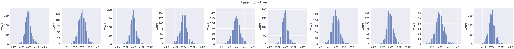
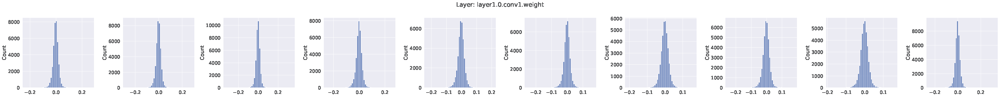
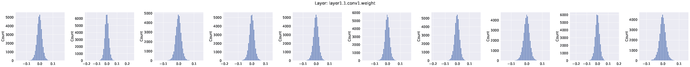
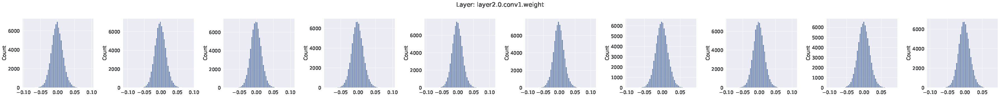
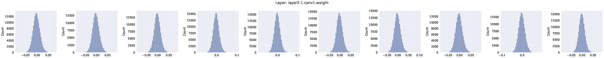
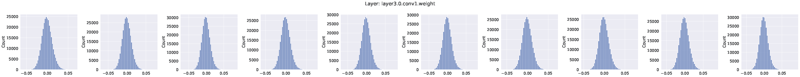
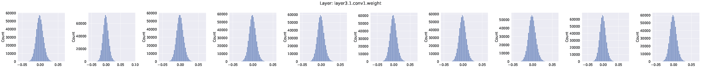
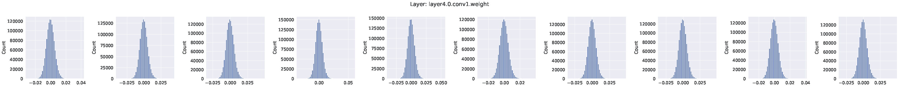
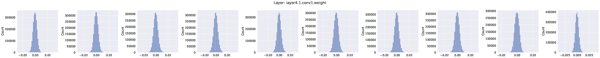
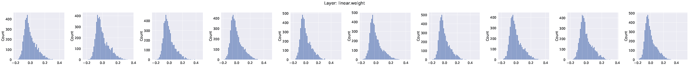

The distribution of pairwise parameter difference across the ten ResNet-18 is as follows:

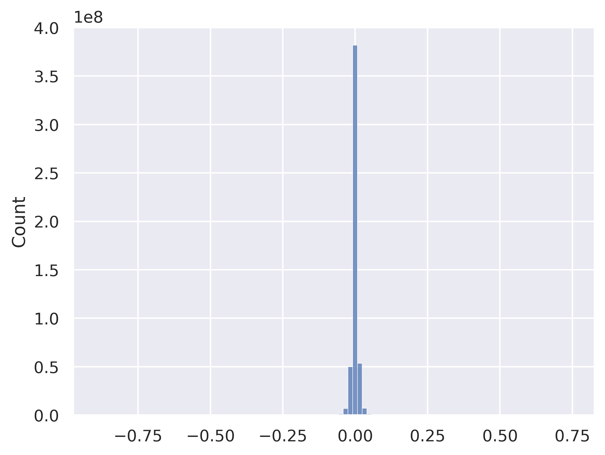

The converged weights from different stochastic training runs have a mean parameter difference of $-4.92\times 10^{-6}$ and an STD of $0.01$, 
Since the certified parameter set with $\sigma=0.25$ and $\eta=1.0$ has sufficiently large probability mass within $[\hat{\theta}-0.5, \hat{\theta}+0.5]$ ($\hat{\theta}$ is the set of parameters of the surrogate), the results suggest that the certified parameter set verified using one of these models as a surrogate can maintain its coverage over classifier weights from other training runs with stochasticity. 
The certified parameter set can effectively capture classifiers trained separately by adversaries following certain standard training procedures.

---

## Acknowledgment

The code used in this work is inherited from the following repository:

[https://github.com/HanxunH/Unlearnable-Examples](https://github.com/HanxunH/Unlearnable-Examples)


